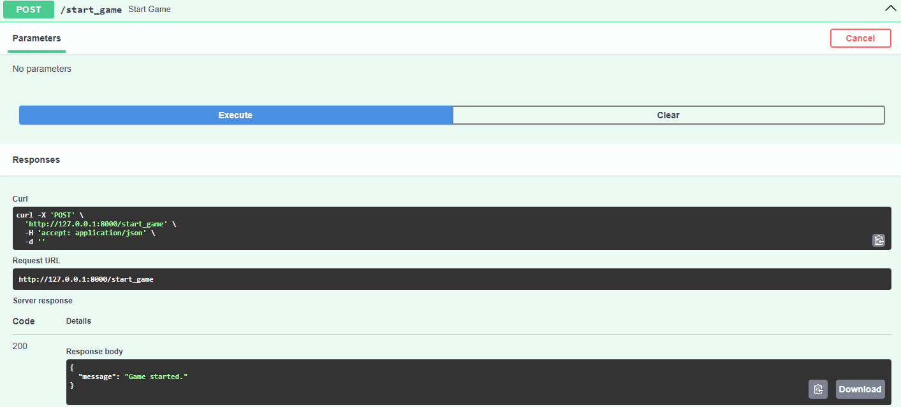
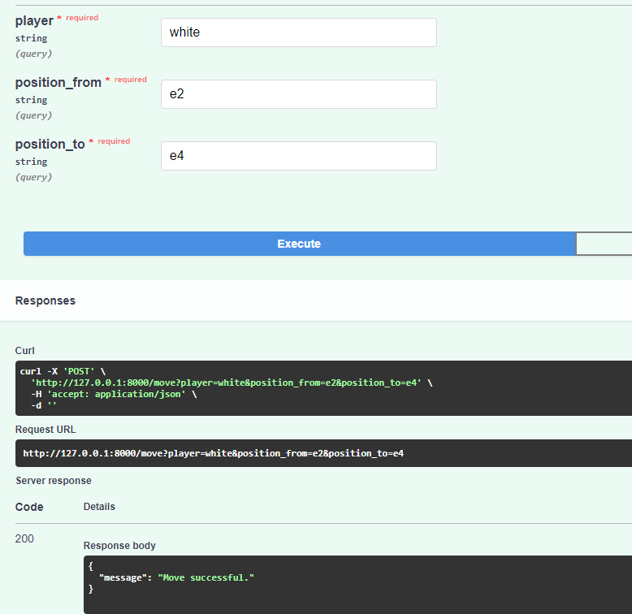
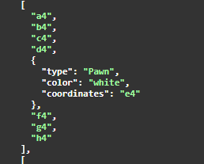
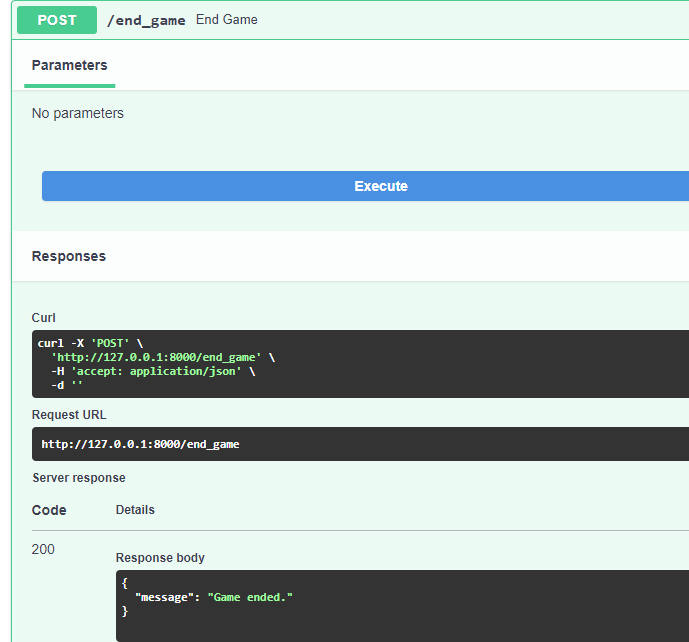

# 🧠 Python Chess Simulator API

This is a Python application that simulates a chess game using **FastAPI**, with move history stored in a **SQLite** database. The app provides endpoints for interacting with the chess logic and viewing game progress.

## 🚀 Technologies Used

- **Python 3**
- **FastAPI** for building the web API
- **SQLAlchemy** for ORM
- **SQLite** for data storage
- **Uvicorn** as ASGI server

## 📸 Features (with Screenshots)

### ♟️ Board Initialization
The game starts with a standard chess board setup.

---

### 🔁 Move Execution
Make legal chess moves via the API and update the board state.

---

### 🕹️ Multiple Moves Simulation
Demonstrates a result of move in a session.

---

### 🏁 Game End State
Game state after a complete or partial session with several moves.

---

## 📂 Project Structure

